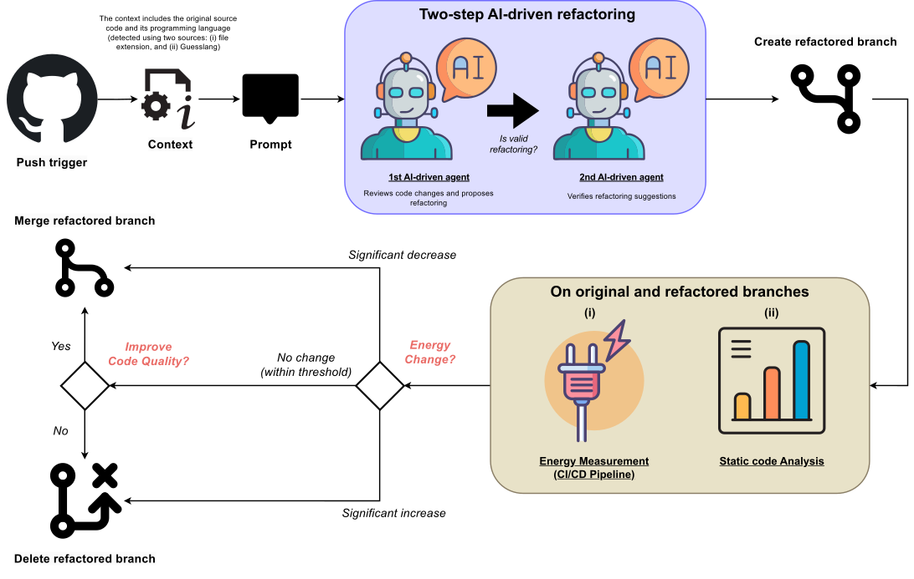

# Orchestrating AI-Driven Code Refactoring Based on Energy Measurements in CI/CD Pipelines

## Abstract

As modern software systems grow in complexity and scale, their energy consumption becomes a critical concern, highlighting the need for automation mechanisms that monitor, manage, and optimize energy consumption while balancing potential trade-offs with other software quality attributes. To address this challenge, this work proposes an n8n-based workflow that incorporates a multi-agent, LLM-driven refactoring process, where one agent recommends code optimizations aimed at improving energy efficiency, and a second agent verifies their correctness. The workflow leverages existing CI/CD processes, such as GitHub Actions, to execute measurable tasks. For example, tests can be used to target the measurement of the application code itself, allowing developers to identify inefficient algorithms, redundant operations, or resource-heavy functions. The execution of the automatically refactored code within the CI/CD pipeline is then compared with that of the original code to assess improvements in energy efficiency and other software quality attributes. We evaluate the workflow through controlled executions to measure its effectiveness and the impact of the AI-driven optimizations. Our results indicate that the proposed n8n-based workflow can effectively support energy-aware software development by automating the coordination of energy measurements and AI-driven code improvements with minimal developer intervention.

## Workflow Overview

##  Repository Structure

- **assets/** — Visual resources
- **evaluation/** — Evaluation results
- **workflow/** — n8n JSON workflow definitions  
- **scripts/** — Automation scripts for the workflow
